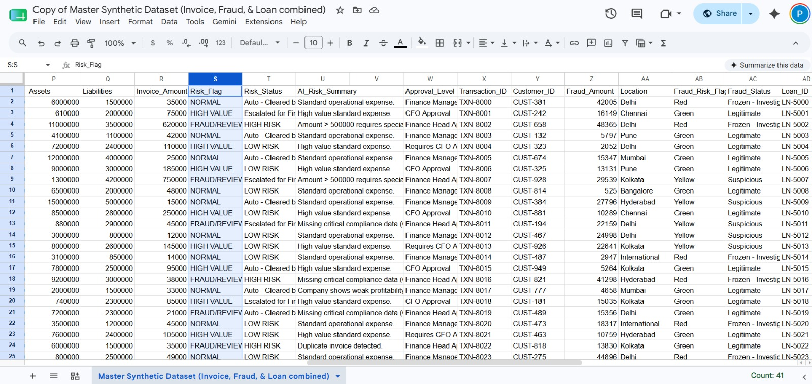
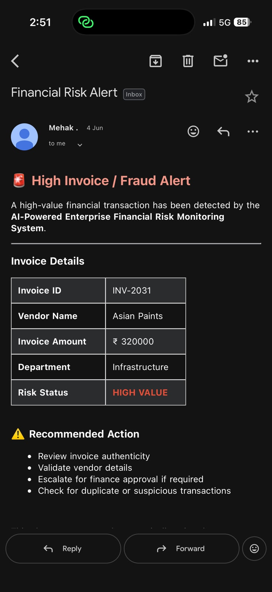
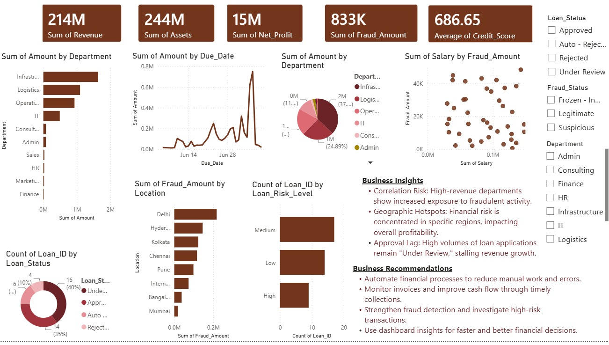

AI-Powered Financial Process Automation using n8n

Overview

This project is an intelligent financial process automation system developed using n8n, Google Sheets, Gmail, Power BI, and an AI Chatbot. The solution automates fraud detection, financial risk monitoring, loan approval notifications, and high-value transaction alerts while providing real-time reporting and analytics.

---

Features

🚨 High-Risk Fraud Alert

- Automatically identifies high-risk fraud transactions.
- Sends instant email notifications to stakeholders.
- Helps reduce response time to potential fraud cases.

⚠️ Financial Risk Alert

- Detects financially risky transactions.
- Generates automated alerts through email.
- Supports proactive risk management.

🏦 Loan Approval Automation

- Processes loan approval records.
- Sends approval and status update emails automatically.
- Maintains updated records in Google Sheets.

💰 High-Value Transaction Monitoring

- Monitors transactions exceeding predefined limits.
- Sends automated notifications for review and compliance.

📊 Google Sheets Integration

- Automatically updates transaction and alert records.
- Serves as a centralized data repository.

📈 Power BI Dashboard

- Interactive dashboard displaying:
  - Fraud Alerts
  - Financial Risk Alerts
  - Loan Approval Status
  - High-Value Transactions
  - Key Business Insights

🤖 AI Chatbot

- Answers user queries related to financial records.
- Provides quick access to information and insights.

---

Technology Stack

- n8n Workflow Automation
- Google Sheets
- Gmail
- Power BI
- AI Chatbot
- Excel Dataset

---

Workflow

1. Financial data is received.
2. n8n evaluates fraud, risk, loan, and transaction conditions.
3. Automated emails are triggered.
4. Google Sheets are updated automatically.
5. Power BI dashboard refreshes with latest data.
6. AI Chatbot provides user assistance and information retrieval.

---

Screenshots

## Workflow Architecture

---

## Google Sheets Integration

---

## High Value 

---

## Financial Risk Alert

---

## High Risk Fraud Detection

---

## Loan Application Risk Assessment

---

## TAX chatbotjpg.jpg

---

## Power BI Dashboard

---

Business Benefits

- Reduces manual effort and processing time.
- Improves fraud detection and risk monitoring.
- Provides real-time visibility into financial operations.
- Enhances decision-making through Power BI analytics.
- Ensures accurate and timely communication through automated emails.

---

Future Scope

- AI-based fraud prediction.
- Advanced risk scoring models.
- Real-time banking API integration.
- Mobile dashboard access.
- Automated compliance reporting.

---

Author

Lovish Chowdhary
MBA Finance
Chitkara University
